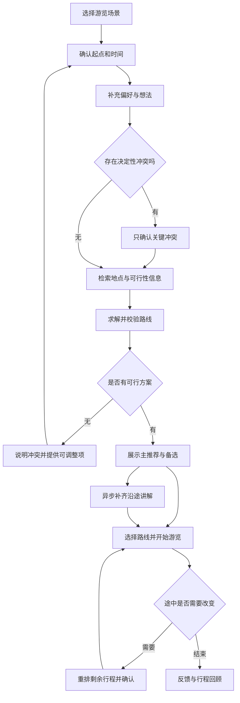
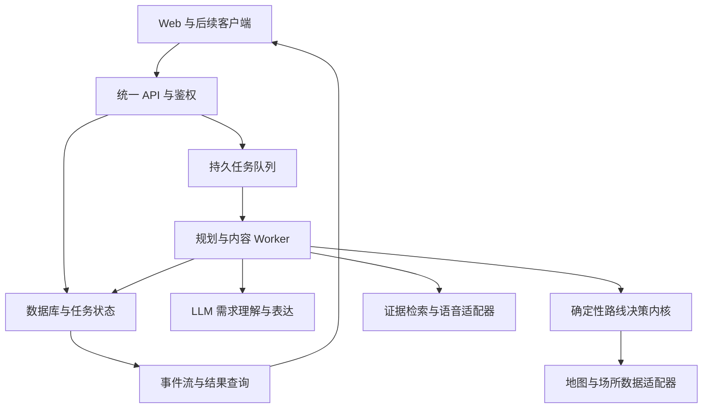
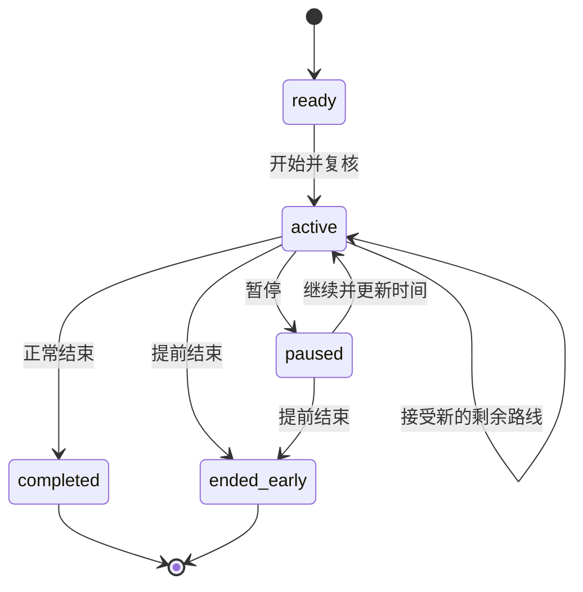

# 智能游览产品：使用逻辑与开发框架 v2.0

> 基于《智能游览路线生成 Agent：想法 1.0》与本轮使用流程说明整理。
> 用途：产品对齐、技术设计、任务拆分，以及作为开发 Agent 的实施依据。
> 调研日期：2026-09-20。首发假设：中国大陆、手机浏览器、中文、一个试点城区及一个有数据的公园。文中的时延、阈值、数量与保留期限均为建议初值，不是实测效果或供应商承诺。

## 目录

1. 产品定义与本次优化
2. 两类场景与范围边界
3. 完整使用流程
4. 信息获取：页面、默认值与交互
5. 定位、坐标和地图的具体实现
6. 需求提取与结构化契约
7. 数据获取与场所数据包
8. 路线生成、求解与校验
9. 先出路线、后补讲解的异步机制
10. 路线呈现与可编辑交互
11. 沿途讲解、语音与到站触发
12. 游览执行与动态重排
13. 反馈、偏好学习与行程留痕
14. Web、APK、小程序技术架构
15. 数据模型与数据库
16. API、事件和状态机
17. 可靠性、权限与成本控制
18. 首版范围与实施顺序
19. 验收标准与实地验证
20. 完整示例与开发 Agent 指令
21. 调研依据与尚待实测事项

## 1. 产品定义与本次优化

**产品定义：把用户当下的位置、时间、兴趣和现实限制，转换成一条可执行、可解释、途中可调整、结束后可回顾的游览路线。**

它的核心交付是“可以持续计算的行程”，包含点位、真实路段、时间安排、执行状态与事实依据。文字攻略、地图和语音是同一份行程的不同呈现方式。

| 原始想法 | 优化后的约定 | 对开发的影响 |
| --- | --- | --- |
| 到陌生景点，希望不重复逛完所有地方 | 默认“覆盖已收录的主要游览点，尽量少走回头路”；全步道覆盖单独建模 | 增加范围、覆盖目标和园内路网数据，不能只排 POI |
| 当前位置或自定义位置 | 将“规划起点”和“设备当前位置”分成两个字段 | 手动规划不会被后续 GPS 更新覆盖 |
| 游览时间段 | 同时支持“逛多久”和“几点前到哪里”，明确包含返程与停留 | 结束点成为求解约束 |
| 出行方式可以跳过 | 跳过表示使用可见默认值；首版默认步行 | 求解器不接收含糊的出行模式 |
| 偏好标签与自然语言 | 标签提供快捷选择，文本补充；冲突只追问决定性事项 | 保存字段来源、优先级和待确认项 |
| 深度调研后生成路线 | 可行性事实先查，文化故事后查 | 拆成关键路径与异步内容任务 |
| 推荐多条路线 | 默认一条主推荐、最多两条有明显取舍的备选 | 做方案去重与差异解释 |
| 自由拖动路线 | 拖动地图、调整站点顺序、拖动线路分别处理 | 首版支持前两项，不将折线编辑当成可通行路线 |
| 途中一键调整 | 保留已完成内容与锁定约束，只计算剩余行程 | 需要执行状态、版本号和变更预览 |
| 结束后总结和优化 | 区分计划、实际、估计、未知，并拆分产品指标与个人偏好 | 缺失轨迹不能补造成“实际走过” |

原稿的 Agent / 决策内核 / 工具分层继续保留。首版不必先选择复杂 Harness：用一个受约束的编排流程、一个 LLM 接口和若干确定性工具即可。Pi、Codex、DSH 可以作为设计参考，本框架不把它们的兼容性或成熟度作为已验证前提。

## 2. 两类场景与范围边界

### 2.1 场景 A：我已经在这里，想好好逛完

入口文案：“逛这里”。用户选择或确认一个公园、校园、景区。

系统先识别场所边界和入口，再提供两种目标：

- **精华游览**：在时间内覆盖最值得去的点。
- **尽量逛全**：在已收录且开放的主要点位/区域中提高覆盖率，并降低重复走路。

“全部”必须有清楚分母，例如“已收录的 12 个主要游览点，本路线覆盖 9 个”。不能把地图搜索结果称为园内所有地方，也不能把到达一个分区入口称为逛完该分区。

第三种“走遍每条步道”留到扩展版：它要求完整的可通行边集合，属于道路覆盖问题。死胡同、唯一桥梁、出入口限制都可能导致必须重复某些路段；全覆盖和绝不重复无法普遍同时成立。

**首版实现深度：一个公园的主要点位覆盖 + 人工校验的步道图。** 对没有步道数据的场所，只提供已知点位之间的路线，并显示数据范围。

### 2.2 场景 B：我想出去走走，还不知道去哪

入口文案：“随便逛逛”。以当前位置或自选起点为中心，根据可用时间、兴趣、体力、结束点选择适合的片区和点位。

不要求用户先说出景点名称，也不默认“点越多越好”。一条两站、沿线舒适的散步路线，可能比六站打卡更符合“放空一下”。

首版以步行为主，支持 30 分钟～8 小时的输入；重点验收 1～4 小时。相较原稿的 2～8 小时，增加短时闲逛，但不扩展到多日旅行。

### 2.3 两类场景共用哪些能力

共用需求结构、时间计算、地图展示、讲解、执行状态、重排与反馈。差异集中在候选点获取和求解目标：场景 A 从场所数据包选点，场景 B 从周边候选池选点。

## 3. 完整使用流程



后台处理是有分支、有恢复点的流程。用户侧保持轻量：**说想法 → 看路线 → 出发 → 随时调整 → 留下记录**。

## 4. 信息获取：页面、默认值与交互

### 4.1 页面结构

首屏采用手机优先布局：上方两个场景入口，中间“从哪里出发”和“有多少时间”，下方一行偏好标签、一段自然语言输入与“生成路线”按钮。“更多条件”默认收起。

不在首次打开时连续弹出定位、麦克风、登录请求。定位权限在点击“使用当前位置”时申请；麦克风在点击录音时申请；可游客规划和体验，账号主要用于跨设备历史同步。

### 4.2 字段与默认值

| 字段 | 交互 | 是否必须 | 默认/缺失处理 |
| --- | --- | --- | --- |
| 场景 | 逛这里 / 随便逛逛 | 必须有值 | 从入口带入 |
| 起点 | 当前位置 / 搜索地点 / 地图选点 | 必须 | 定位失败允许手动选择 |
| 场所 | 搜索并确认公园、景区、校园 | 场景 A 必须 | 同名场所展示城市与地址 |
| 开始时间 | 现在 / 今天稍后 / 日期时间 | 必须有值 | 现在；开始游览时重新校验 |
| 时间预算 | 30 分钟、1h、2h、半天、自定义 | 必须 | “半天”展开显示具体时长，例如 4h |
| 最晚结束 | 到几点 / 不限具体钟点 | 有硬截止时必须 | 时长自动推导结束时刻 |
| 结束位置 | 回到起点 / 指定地点 / 顺路结束 | 必须有值 | 回到起点，明确可改 |
| 交通方式 | 步行 / 骑行 / 暂不选择 | 必须有值 | 暂不选择时显示“按步行规划” |
| 强度 | 轻松 / 适中 / 多走走 | 可跳过 | 适中；不得自动推断健康情况 |
| 兴趣 | 自然、公园湿地、街区、人文、建筑、美食 | 可多选、可不选 | 不限；不要求填满 |
| 想法 | 文本或语音转文字 | 可跳过 | 提供一句示例即可 |
| 必去/避开 | 地点搜索、自然语言提取 | 可选 | 解析后显示可删除标签 |
| 预算 | 免费优先 / 自定义金额 | 可选 | 免费优先是软偏好，不等于零元硬上限 |
| 特别需要 | 少台阶、推婴儿车、休息多等 | 可选 | 关键可达性作为硬条件，无法核验要告知 |
| 讲解风格 | 少打扰 / 适量 / 想了解更多 | 可选 | 适量；默认点击播放 |

首版骑行可先作为受控功能开关：只有骑行路线提供者、禁行规则与实测通过后才向真实用户开放。不能显示可用骑行选项，再用步行时间代替计算。

### 4.3 时间选择器的具体规则

采用两种互斥主模式：

1. **我有多久**：开始时间 + 持续时长，系统推算预计结束。
2. **我要几点前到**：开始时间 + 截止时刻 + 结束地点，计算剩余预算。

用户同时说“逛两小时，五点前回学校”，取可同时满足的较紧约束，并在确认条展示；如果开始时间已经超过截止时间，则请求修正日期或时间。

时间预算包括去第一站、站间移动、停留、等待、休息及到结束点。仅“景区内部游览”的计时，应明确显示，不暗中忽略往返交通。

服务端保存绝对时间与 IANA 时区。前端不要直接发送“今天下午”供求解器猜测。数据库建议使用 `timestamptz` 保存时刻，另存 `timezone` 保存场所时区名称；`timestamptz` 本身不会保留原始时区名称。[PostgreSQL 日期时间文档](https://www.postgresql.org/docs/current/datatype-datetime.html)

### 4.4 需求确认条，而非第二份问卷

解析后显示一行可编辑条件，例如：“现在出发 · 2 小时 · 步行 · 回到南门 · 自然优先 · 少台阶”。未冲突时直接进入规划，随时能回改。

需要追问的情形限于会实质改变路线的缺失或冲突：同名景点、是否必须回到起点、硬截止已不可满足、必去点关闭、步行与自然语言骑行冲突。

不追问“喜欢哪些建筑风格”这类非必要细节。系统默认值应可见，但不要为每个默认值弹窗。

## 5. 定位、坐标和地图的具体实现

### 5.1 首版默认实现

**Web 地图选高德 JS API 2.0；设备定位通过浏览器 Geolocation；地点搜索、逆地理编码和路线查询通过自有后端调用地图服务。** 高德 `AMap.Geolocation` 可作为需要时切换的定位适配器，不同时叠加两套自动回退。

浏览器的定位接口是 `navigator.geolocation.getCurrentPosition()`，持续更新是 `watchPosition()`，依赖安全上下文及用户权限；高精度选项是请求更准确定位，不代表一定使用 GPS 或达到某一精度。[MDN Geolocation](https://developer.mozilla.org/en-US/docs/Web/API/Geolocation_API)

定位步骤：

1. 用户点击“使用当前位置”。
2. 检查 `navigator.geolocation`；浏览器支持的情况下可用 Permissions API 辅助识别状态，但不能依赖其覆盖所有终端。
3. 请求一次定位，建议初值：`enableHighAccuracy: true`、`timeout: 10000`、`maximumAge: 15000`。
4. 获得原始经纬度、精度、采样时间；进行坐标标准化。
5. 在地图显示位置和精度范围；若精度差，让用户调整规划起点。
6. 调用后端逆地理编码获得地址标签。逆地理编码失败不应使已获得的坐标失效。
7. 用户点击开始游览后，再按需启动持续定位；暂停、结束、页面退出时清理监听。

浏览器原始定位通常按 WGS84 接口契约处理；地图供应商和宿主 SDK 输出必须按各自接口定义标记，不凭“看起来偏了一点”猜坐标系。

### 5.2 最小定位代码示意

以下代码仅演示定位边界，不是完整可运行应用。`normalizeCoordinate` 与 `describeLocationError` 属于待实现业务函数。

```ts
async function locateForPlanning() {
  if (!navigator.geolocation) {
    return { ok: false, reason: 'UNSUPPORTED', fallback: 'pick_on_map' };
  }
  try {
    const p = await new Promise<GeolocationPosition>((resolve, reject) => {
      navigator.geolocation.getCurrentPosition(resolve, reject, {
        enableHighAccuracy: true,
        timeout: 10_000,
        maximumAge: 15_000,
      });
    });
    const raw = {
      lng: p.coords.longitude,
      lat: p.coords.latitude,
      crs: 'WGS84' as const,
      source: 'browser' as const,
      accuracyM: p.coords.accuracy,
      observedAt: new Date(p.timestamp).toISOString(),
    };
    // 一次规范化；已经是 GCJ02 的适配器结果不能再次转换。
    const point = await normalizeCoordinate(raw);
    return { ok: true, point, needsReview: raw.accuracyM > 80 };
  } catch (error) {
    return { ok: false, reason: describeLocationError(error), fallback: 'pick_on_map' };
  }
}
```

`80m` 只是提示复核的初值，不是“在 80m 以内就一定正确”。园内岔路、入口、跨河点位需要更严格的精度与路径判断。

### 5.3 失败与降级

| 情况 | 用户体验 | 程序行为 |
| --- | --- | --- |
| 权限拒绝 | “可以搜索地点或在地图上选起点” | 不反复弹权限、不以 IP 冒充精确位置 |
| 请求超时 | 保留输入，提供重试和选点 | 不清空表单 |
| 室内/信号差 | 显示精度范围，允许纠正 | 不自动判定到站或走错路 |
| 只能获得城市 | 展示城市地图并让用户选起点 | 仅用城市缩小搜索范围 |
| 手选未来游览地 | 继续正常规划 | `planningOrigin` 与 `deviceLocation` 分离 |
| 重新打开页面 | 显示原行程，点击继续后重新定位 | 不将上次位置当成实时位置 |

高德定位插件支持浏览器定位，并提供城市级定位方式，但接入仍需处理权限、网络与设备差异。[高德 JS 2.0 定位](https://lbs.amap.com/api/javascript-api-v2/guide/services/geolocation)

### 5.4 坐标统一：一个必须写进代码契约的约束

内部位置对象固定使用 `{lng, lat, crs}`，所有数组接口固定 `[lng, lat]`。面向大陆高德地图的路线计算/展示统一使用 GCJ02；原始设备坐标独立保留其来源类型，仅在确有用途和用户允许时保存。

高德提供非高德坐标向高德坐标的转换服务。转换只发生在适配器入口，严禁对已转换数据二次偏移。[高德坐标转换](https://lbs.amap.com/api/webservice/guide/api/convert)

路线几何存为自定义 `RouteGeometry {crs, coordinates}`。不要把 GCJ02 数组不加说明地作为标准 GeoJSON 导出；RFC 7946 规定 GeoJSON 使用 WGS84。后期接入 WGS84 路网或 GIS 数据时，由明确的空间数据适配器处理坐标与距离计算。[GeoJSON RFC 7946](https://datatracker.ietf.org/doc/html/rfc7946#section-4)

### 5.5 开发环境与 Key

- 真机访问使用 HTTPS 测试域名；电脑 `localhost` 可用不代表手机访问局域网 HTTP 地址也可定位。
- 申请独立的高德 Web JS Key 与 Web 服务 Key，配置各自限制，开发/生产分开。
- JS Key 会出现在浏览器中；服务端地图 Key、LLM Key、ASR/TTS 密钥不得打进前端包。
- 高德 JS 安全密钥优先用官方 `serviceHost` 代理方案；固定允许的上游和路径，并做配额控制，不能变成开放代理。[高德 JS API 安全密钥](https://lbs.amap.com/api/javascript-api-v2/guide/abc/jscode)
- 未提供真实 Key 时允许显式演示模式，但页面必须标注模拟数据；不得将模拟路线宣称已接通地图服务。

## 6. 需求提取与结构化契约

### 6.1 三层处理

1. **确定性预处理**：时间、单位、枚举、已选 POI ID 由程序解析和验证。
2. **LLM 理解**：从自然语言提取目的、兴趣、约束、否定和模糊词，返回 Schema 对应字段。
3. **规则合并与校验**：解决字段冲突、应用可见默认值、判定是否追问，形成 `NormalizedIntent`。

表单和文本同次提交冲突时，不让 LLM 静默覆盖。已确认的用户修改优先；否则记录冲突并询问。历史偏好只能补足未明确指定的软偏好，不能改变本次预算、必去点或交通方式。

“安静点”表示偏好，不等于系统掌握实时人流。“不收费”可以解释成零门票硬条件，但“免费优先”是偏好。少台阶与必须轮椅可达也要分开。

### 6.2 建议核心类型

```ts
type Coordinate = {
  lng: number;
  lat: number;
  crs: 'WGS84' | 'GCJ02';
};

type NormalizedIntent = {
  schemaVersion: '1.0';
  intentId: string;
  revision: number;
  scene: 'venue' | 'wander';
  objective: 'highlights' | 'poi_coverage' | 'relax';
  venueId: string | null;
  origin: { point: Coordinate; poiId: string | null; entranceId: string | null };
  endpoint:
    | { mode: 'return_to_origin' }
    | { mode: 'fixed'; point: Coordinate; poiId: string | null }
    | { mode: 'flexible' };
  startAt: string;
  latestEndAt: string;
  timezone: string;
  mobility: 'walk' | 'bike';
  pace: 'easy' | 'normal' | 'active';
  interests: Array<{ tag: string; weight: number }>;
  hard: {
    mustVisitIds: string[];
    avoidPoiIds: string[];
    maxDistanceM: number | null;
    maxCostCny: number | null;
    stepFreeRequired: boolean;
  };
  soft: {
    freePreferred: boolean;
    repeatRoadPenalty: number;
    restPreferred: boolean;
    quietPreferred: boolean;
  };
  rawText: string;
  unresolved: Array<{ field: string; question: string; reason: string }>;
  fieldEvidence: Record<string, {
    source: 'form' | 'text' | 'profile' | 'default' | 'user_confirmed';
    rawSpan?: string;
  }>;
};
```

所有 ID 必须从工具或自有数据解析，模型不能创造 POI ID。模型输出字符串地名先进入实体解析，再获得规范 ID、地址与入口。

### 6.3 输出校验与重试

要求模型返回 Schema 约束 JSON；服务端校验枚举、数字范围、经纬度、结束晚于开始、已知地点 ID、必去与避开不相交。JSON 无效最多修复一次；仍失败则使用已有表单字段并告知哪些文本条件尚未解析。

工具返回或检索网页属于数据，不是指令。网页里的“忽略系统提示”等内容不得修改 Agent 权限、调用额度或路线约束。

### 6.4 LLM 与程序的责任

| LLM 负责 | 程序/工具负责 |
| --- | --- |
| 理解“想放空一下”等目标 | 获取坐标、真实路线、营业信息 |
| 提取约束和解释冲突 | 硬约束判定、时间累加、费用计算 |
| 根据证据撰写推荐理由与讲解 | 地点筛选、路线求解、版本提交 |
| 将“我累了”转为调整意图 | 对剩余行程重新计算与验证 |

模型不能自行声称“该入口可通行”“场馆现在开放”“这条路允许骑行”。缺乏证据时存为 `unknown`。

## 7. 数据获取与场所数据包

### 7.1 数据源分工

| 数据 | 首版来源 | 更新与失败策略 |
| --- | --- | --- |
| POI、地址、入口参考 | 地图搜索 + 试点人工校验 | 保留 provider ID；同名消歧 |
| 路段、距离、交通时长 | 地图路线服务；园内使用已校验路网 | 无路径时不能用直线顶替可执行路线 |
| 场所边界、游览区域、禁行边 | 自建试点场所数据包 | 版本化，巡查后更新 |
| 开放时段、预约、临时闭馆 | 场馆官方公告、官方页面、人工维护 | 获取不到标 unknown；关键限制未满足则替换/阻断 |
| 天气 | 有权限的天气 API | 保存发布时间；失败时不声称天气适宜 |
| 历史、人文、建筑背景 | 官方介绍、文博机构、授权资料 | 事实提取后生成，来源随内容保存 |
| 厕所、饮水、休息设施 | 地图 + 园区公开信息 + 实测 | 可缺失；不凭空生成设施 |
| 人流、排队、遮阴 | 有可信数据时接入 | 首版不冒充实时数据，可接收用户报告 |

高德 POI 服务支持关键词、周边、多边形和 ID 查询，且明确不提供全量数据。它适合发现候选点，不足以证明一个公园的全部点位已穷尽。[高德 POI 搜索](https://lbs.amap.com/api/webservice/guide/api-advanced/search)

高德天气按行政区域返回当前或预报信息；据此只能提供对应粒度的天气参考，不能推导某条步道此刻积水、某站十分钟后开始下雨。[高德天气查询](https://lbs.amap.com/api/webservice/guide/api-advanced/weatherinfo)

### 7.2 必须补一个轻量运营后台

即使面向用户只有 WebUI，也应有受保护的管理入口或导入脚本，用来维护：

- 场所边界与开放入口；
- 已收录 POI 及主要游览区域；
- 步道路段、台阶、骑行限制、临时封闭；
- 营业时间、来源、核验时间；
- 讲解事实和审核状态；
- 数据包发布/回滚。

没有维护入口，开发团队只能不断改代码来处理“入口关了”“这段不能走”，产品很难持续使用。

### 7.3 场所数据包结构

`VenuePack = 场所元数据 + 点位 + 路网 + 事实 + 来源 + 发布版本`。

| 对象 | 必备字段 |
| --- | --- |
| Venue | id、名称、范围坐标、时区、开放入口、coverageScope、packVersion |
| Node | id、坐标、类型（入口/岔路/POI/设施）、可达状态 |
| Edge | id、from、to、方向、geometry、长度、walk/bikeAllowed、台阶/坡度已知值、开放时间、证据 |
| POI | id、入口节点、兴趣标签、最短/建议停留时间、开放窗口、费用、预约状态 |
| Evidence | sourceUrl、sourceTitle、retrievedAt、effectiveFrom/To、expiresAt、license、reviewStatus |

未知台阶或骑行权限不能当作“无台阶/允许骑行”。步道图导入时检查断点、孤立节点、跨水误连和方向错误；交叉画线不等于两条道路真实连通。

### 7.4 获取与缓存策略

候选检索先覆盖几个不同类别，去重后保留约 20～40 个，评分压缩到约 8～12 个进入精算。实际数量随配额和区域密度调节。

来源冲突不只按“哪个抓取时间新”决定：保存发布日期、生效时间、获取时间和可信级别。临时闭馆公告应能覆盖常规营业表；刚抓到的旧介绍不能覆盖新公告。

缓存有效期是业务新鲜度与供应商许可共同决定的上限。自有场所包可以版本化保存；第三方 POI/路段/内容只按许可存储和展示，不默认可无限期缓存或跨底图复用。

## 8. 路线生成、求解与校验

### 8.1 把“选哪里”与“怎么走”分开

- **推荐层**：筛选适合用户的点位或区域。
- **求解层**：决定取舍、访问顺序、入口和各站停留时间。
- **路由层**：获得两点之间真实可走的路径。
- **校验层**：检查完整路线能否满足约束。

两个相邻推荐点之间的最短路线，未必是最有游览价值的路线。首版在有数据的公园将景观路段纳入权重；城区先选好点位并使用真实路由，后期再增强沿街风景评分。

### 8.2 两类目标的算法

**随便逛逛**可建模为“时间预算内选择高价值点位并排序”的问题。首版用可解释启发式：必去点骨架 → 按收益/增量时间插入可选点 → 局部换序/替换 → 全量时间校验。候选少时可用 beam search 保留若干部分方案；不追求证明全局最优。

**场所主要点覆盖**使用已发布的路网图，在开放入口、截止时间与已确认必去点约束下最大化覆盖，并惩罚重复边。覆盖所有目标点与覆盖所有道路是不同目标，不能共享同一个“覆盖率”字段。

扩展到复杂时间窗时，可用 OR-Tools 的时间维度和可选点惩罚建模。官方已有时间窗与放弃访问点的示例；需要自行加入游览停留时间、入口和产品目标，不是套上示例就得到旅游规划器。[OR-Tools 时间窗](https://developers.google.com/optimization/routing/vrptw)、[可选访问点与惩罚](https://developers.google.com/optimization/routing/penalties)

### 8.3 硬约束先过，再谈推荐得分

硬约束包括截止时间、结束位置、明确的距离/预算上限、必去点、避开点、已知禁行和已确认无障碍要求。已知违反就不可发布为满足需求的方案；不能用更高兴趣分抵消超时或闭馆。

软得分可初步设为：

`兴趣匹配 + 已知景观价值 + 类型多样性 + 覆盖奖励 − 移动负担 − 重复路段 − 信息不确定性 − 与用户节奏不符`。

各项归一化后再设置权重，不能将“米数”直接与 0～1 兴趣得分相加。权重是可配置策略，保存 `policyVersion`。

### 8.4 时间计算

对每一站 i：

```text
arrival[i] = departure[i-1] + travelTime[i-1,i]
visitStart[i] = max(arrival[i], openAt[i])
departure[i] = visitStart[i] + dwell[i]
```

同时检查最晚入场、预约窗口和最晚离场。午休等多段开放窗口不能压成一个全天区间。若需要在闭馆前逛完，应校验 `departure <= closeAt`；只有入场限制的场所，要按其真实规则处理。

总预算 = 到第一站 + 站间移动 + 各站停留 + 等待 + 休息 + 到结束点 + 缓冲。

初值可将总预算的 10%～15% 保留为缓冲，并设置上限避免短行程被过度压缩；具体由实地误差校准。路线卡可显示预计区间，但没有统计数据前不得标为“95% 置信保证”。

### 8.5 少走回头路的实现

在自有路网中，以物理路段 ID 合并正反向边，计算重复距离：

`repeatRatio = (总行走长度 − 去重后的物理路段长度) / 总行走长度`。

真实环路返回起点不等于走回头路；死胡同进出产生重复则应计入。有向禁行仍按有向边处理通行。

商业路由若只返回 polyline，没有稳定路段 ID，可对本次会话内折线做空间匹配估计重叠，作为近似指标；不可宣称精确道路覆盖率，也不据此拼凑永久道路数据库。

### 8.6 路段请求与配额

步行路由可由服务端请求高德 `/v3/direction/walking`，传入起终点及可用的 POI ID，解析距离、耗时和步骤折线。多站顺序由本系统求解，再逐段连接。[高德步行路径规划](https://lbs.amap.com/api/webservice/guide/api/direction)

首版不要默认存在可无限调用的步行矩阵：12 个节点的完整有向矩阵是 132 个两点请求，再计入起终点还会增加。

实现采用两层：直线距离仅用于粗筛和候选排序；精算阶段按需请求可能使用的路段，缓存同任务结果。即将发布的所有路段必须获得真实路由或来自已校验步道图。请求失败的边保持 `unknown`，明确无路的边标为 `unreachable`。

首次可先核验最有希望的一个方案，发布后再算备选。不能以稀疏查询遗漏为依据断言“整个区域没有可行路线”；耗尽搜索预算时应区分“已证实冲突”和“当前未找到方案”。

### 8.7 发布前校验清单

1. 所有地点和入口可解析、属于规划区域。
2. 路段连续，交通模式一致，不使用直线伪装步道。
3. 时间窗、停留、返程、预算计算一致。
4. 必去点存在，避开点不存在，硬约束均满足。
5. 可达性未知但关系到硬条件时，不标为可执行。
6. 信息来源、新鲜度和未知项保存完整。
7. 路线卡、地图、时间轴来自同一 `routeVersion`。

普通信息仍不完整但不影响通行时，可以展示“条件性方案”，清楚列出待确认项。关键预约、封闭、无障碍等未确认时，不能挂上“已验证可直接出发”的状态。

### 8.8 不可行时怎么处理

返回结构化 `Conflict`：违反字段、证据、最小调整建议、候选替代。

例如：“保留 A、B 并 17:00 回南门，目前估算至少需要 150 分钟，你只有 120 分钟。”给出“去掉 B”“结束改为东门”“延后 30 分钟”三个具体选择。硬截止不能自动放宽；必去点不能悄悄删除。

## 9. 先出路线、后补讲解的异步机制

### 9.1 两条处理链

**关键路径**：规范需求 → 候选点 → 必要动态事实 → 路由与求解 → 可行性校验 → 发布路线。

**内容路径**：可信资料检索 → 事实提取 → 短讲解 → 详细讲解 → 音频生成。路线点位稳定后即可启动；优先当前站、下一站，再处理后续站。

如果资料检索发现的是影响路线成立的新事实，例如临时闭馆，必须发出路线风险事件，而非只更新讲解。纯内容完成不应悄悄改变路线。

### 9.2 等待界面

| 阶段 | 展示 | 用户可以做什么 |
| --- | --- | --- |
| 理解需求 | 条件标签与“正在确认你的想法” | 修改条件、取消 |
| 找地点 | 真实返回的候选点与“正在查找适合的地点” | 查看区域 |
| 算路线 | “正在核对步行时间与开放情况” | 查看已确认条件 |
| 主路线可用 | 地图、时长、第一站、开始按钮 | 立即查看或开始 |
| 备选生成中 | 小型加载提示 | 不阻挡主路线 |
| 讲解补充中 | 各站“讲解准备中”或已有短介绍 | 阅读已完成内容 |
| 部分失败 | “路线已就绪，部分讲解稍后重试” | 正常游览 |

不模拟百分比，不展示虚构的 Agent 思考过程。进度由真实任务阶段和已完成数量产生。

### 9.3 后端任务与事件

`POST /v1/plans` 返回 `202 + planId + jobId`。API 进程负责接单与鉴权，持久任务队列驱动 Worker 完成工作。不能在 HTTP 返回后寄希望于一个未持久化的后台 Promise 继续运行。

建议 Redis + BullMQ，数据库存任务业务状态。队列负责调度和重试，数据库负责可查询结果。Worker 需要幂等，不能把任务重试理解为“恰好只执行一次”。[BullMQ Worker 文档](https://docs.bullmq.io/guide/workers)

Web 使用 SSE 接收服务端事件，用户修改仍走普通 HTTP；SSE 不承担客户端到服务端写入。事件需要编号，支持断线后拉取缺失事件或直接同步最新快照。[MDN SSE](https://developer.mozilla.org/en-US/docs/Web/API/Server-sent_events/Using_server-sent_events)

建议事件类型：

```ts
type PlanEventType =
  | 'intent.normalized'
  | 'clarification.required'
  | 'candidates.ready'
  | 'route.ready'
  | 'route.alternative_ready'
  | 'guide.text_ready'
  | 'guide.audio_ready'
  | 'route.risk_detected'
  | 'job.failed'
  | 'job.completed';

type EventEnvelope<T> = {
  eventId: string;
  seq: number;
  jobId: string;
  planId: string;
  requestRevision: number;
  routeVersion: number | null;
  occurredAt: string;
  type: PlanEventType;
  payload: T;
};
```

前端只把事件应用到匹配的任务和版本；旧路线的异步音频不得插入新路线下一站。取消任务设置取消标志，Worker 在阶段边界检查；已经完成且允许复用的事实可以留在内容缓存，但不继续向已取消页面推送。

### 9.4 时延与成本预算

试点初始目标：缓存/场所包充分时主路线 P50 ≤ 10 秒、P95 ≤ 30 秒；不是对公网检索或第三方服务的承诺。超过 30 秒继续显示真实阶段；到任务预算上限时提供重试、简化条件或已有可行结果，不无限等待。

深度讲解允许更慢，优先保证第一站可读。用户未选择的备选路线只做简要说明，不提前为所有候选点生成长文和音频。

## 10. 路线呈现与可编辑交互

### 10.1 一条主推荐，最多两条备选

主推荐卡先展示：路线主题、总时长、移动距离、站数、结束位置、预估费用、一个主要取舍。

例如：“水边慢走 · 约 110 分钟 · 3.2km · 4 站 · 返回南门”。数值必须来自计算结果；费用未知时写“部分待确认”，不能显示 0 元。

备选的差异应该真实，例如“少走约 1km，但不经过湿地”“多一个历史点，预计多用 25 分钟”。数据只支持一条可行路线时就显示一条，不换三个名字凑数量。

方案差异用点位集合重合度、沿途路段重合度、主题和体力负担共同衡量。首版可通过不同权重生成候选，阈值过滤近似重复方案；不能仅改推荐文案。

### 10.2 页面布局

- 手机：上方地图，下方可伸缩路线卡；卡片展开为时间轴，收起保留下一站。
- 桌面：地图与路线列表并列。
- 地图：起终点、编号站点、真实路线、当前位置；已走与未走用颜色和线型共同区分。
- 时间轴：到达区间、建议停留、去下一站距离、核心限制、讲解入口。
- 站点详情：为何推荐、开放依据、设施、替换/移除/锁定。

游览页固定优先展示“下一站”和“调整行程”，不让长篇讲解抢占操作空间。

### 10.3 三类拖动的实现

| 用户操作 | 首版范围 | 实现规则 |
| --- | --- | --- |
| 拖动、缩放地图 | 支持 | 只改变视图，不改行程 |
| 拖动站点顺序 | 支持 | 产生修改请求，重算路段/时间；校验成功后确认替换 |
| 拖动线路经过某条街 | 扩展项 | 将落点吸附到可通行网络，转为途经约束，再请求路由 |

提供站点“上移/下移”按钮作为拖拽替代；手机手势与地图拖动冲突时，编辑顺序在时间轴专用模式内进行。

地图折线编辑工具只会改变几何形状，本身不能证明路可走。跨湖拖出的一条直线不能成为导航路线。

### 10.4 开始游览前再校验

如果用户看方案期间已过去十分钟，点击开始时以真实开始时刻重排时间；若有变化，仅提示受影响部分。旧计划不能直接把过去的到达时间当作现在仍能完成。

开始时创建 `Trip`，绑定路线版本；规划浏览和实际执行从此分开。路线编辑不会回写历史执行事实。

## 11. 沿途讲解、语音与到站触发

### 11.1 讲解的内容结构

每个 POI 生成三层内容：

1. **眼前看什么**：一两句，引导用户观察现场。
2. **简短讲解**：目标约 30～60 秒，说明最值得知道的背景。
3. **深入了解**：用户主动展开，包含历史细节和来源。

字段建议：`poiId、contentVersion、language、summary、shortScript、detail、claims、sources、verifiedAt、audioStatus`。音频生成后记录真实时长；不能只按字数假装精确播放秒数。

`claims` 保存关键事实与证据 ID 的对应关系。年份、人名、事件、建筑用途必须有依据。地方传说明确标为传说；资料冲突不能合成一个确定答案。

“沿线”也可包括路段，但只有已有匹配的讲解点/景观段才触发。不要为了每走几十米就播报而自动虚构故事。

### 11.2 资料生产流程

试点先人工整理每站少量权威材料，运行时优先复用。开放区域再按需检索：规范地点名称和城市 → 查找官方/可信来源 → 读取正文 → 提取事实 → 生成讲解 → 核验事实引用 → 发布。

搜索摘要不是充分证据；读取失败时保留已验证的短介绍或显示内容暂缺。首版资料量不大时，用结构化事实表和全文检索即可，不急着加入向量库。

内容抓取与模型处理设置文档长度、来源数、超时和每站预算。外部 URL 抓取必须阻断内网/本机地址与重定向绕过，防止用户链接触发服务端任意访问。

### 11.3 语音输入

首版最稳妥的基础是文本框，用户也能使用手机键盘语音输入。

应用内录音作为下一层：点击录音 → `getUserMedia({audio:true})` → `MediaRecorder` 收集片段 → 上传后端 → ASR → 展示可编辑转写文本 → 用户提交。使用 `MediaRecorder.isTypeSupported` 检查实际编码格式，服务端按真实 MIME 解码；不能把所有浏览器录音都当成 WAV。[MDN MediaRecorder](https://developer.mozilla.org/en-US/docs/Web/API/MediaRecorder)

建议录音上限 60 秒、上传大小上限与超时可配置；失败后保留可编辑文本入口。不要只依赖 Web Speech `SpeechRecognition`：其浏览器覆盖有限，部分实现依赖外部服务。[MDN SpeechRecognition](https://developer.mozilla.org/en-US/docs/Web/API/SpeechRecognition)

### 11.4 语音播报

默认手动点击“听讲解”；可选开启本次行程的到站播报。后端 TTS 生成音频，前端 `<audio>` 播放；支持暂停、继续、倍速、文本切换和停止。

浏览器自动播放受到用户交互等策略限制，不能假设到站就能无条件出声。捕获播放失败并回退到播放按钮。[MDN 自动播放指南](https://developer.mozilla.org/en-US/docs/Web/Media/Guides/Autoplay)

TTS 缓存键包含文本哈希、语言、声音与合成配置。当前路线取消或当前站变化时停止旧播放；多站触发采用单一播放队列，导航提示优先于长讲解。

### 11.5 到站触发规则

首版定位辅助只用于“可能到达”的提示，最终可一键确认。建议初值：位置精度优于 30～50m、距离目标入口约 40m 内、持续 20 秒或多个合格采样、当前路线下一站匹配、没有近期触发记录。

这些阈值必须按试点实测调节。若两个 POI 很近、隔河相邻、入口不一致或精度不足，停止自动判定，改为“你到这里了吗？”不要通过放大围栏容忍差定位，这会扩大误触发。

园内能做路径匹配时结合入口/路网判断；禁止仅凭圆形距离把隔着围墙的位置视为到达。用户手动确认作为高可信记录，定位推断保留 `inferred` 标记。

## 12. 游览执行与动态重排

### 12.1 第一版提供的快捷操作

| 用户按钮/表达 | 转为系统事件 | 调整范围 |
| --- | --- | --- |
| 我累了 | `fatigue_reported` | 降低剩余距离，增加可核验休息点，提供提前结束 |
| 下雨了 | `rain_reported` | 减少不合适露天段；有可信室内备选时替换 |
| 这站不去了 | `stop_skipped` | 删除该站；若为锁定必去点先提示 |
| 排队太久 | `queue_reported` | 输入预估等待或选择跳过，重算截止 |
| 这里关门了 | `closure_reported` | 当前行程排除该点/边，保留报告待核验 |
| 只剩 30 分钟 | `deadline_changed` | 更新真实截止，以当前位置重排 |
| 我要回去了 | `finish_requested` | 计算到原结束点或新指定终点的路线 |
| 想加一个地方 | `stop_add_requested` | 解析目标，展示新增时间与距离 |

用户报告可以立即影响自己的路线；未核验前不能把它传播成所有人的官方事实。

### 12.2 重排算法输入

输入当前可信位置、当前时间、已完成/跳过点、正在进行的路段、锁定点、结束点、原约束、变更原因与 `baseRouteVersion`。

只重排尚未完成部分；已访问事实保持不变。手动选点但未提供实时定位时，先让用户确认“从哪里继续”。不能从已经过时的规划起点计算“现在返程”。

### 12.3 提议—确认—提交

1. 后端生成新的候选版本，不覆盖正在执行的版本。
2. 返回差异：“跳过湿地，预计少走 0.8km，仍在 17:00 前回南门”。
3. 用户确认后，事务内比较原版本与当前版本；一致则切换。
4. 版本不一致返回 `409 ROUTE_VERSION_CONFLICT`，前端刷新当前状态。
5. 用户取消则保留原路线。

轻微 ETA 更新可以自动刷新，并标注更新时间；改变站点、终点、交通方式或硬约束，需要用户看见并确认。已封闭路段可立即提示停止继续前往，同时给出替代方案。

### 12.4 偏航与时间落后的检测

Web 首版不用每秒调用 LLM。前台位置更新由规则判断：多次合格采样持续远离路径、停留超出安排、接近硬截止时才提出调整建议。

建议初值为连续约 30 秒超过路径容差，且定位质量足够；桥梁、园区入口等区域使用专门规则。一个 GPS 漂移点不能触发重规划。

时间偏差大于某个业务阈值，例如超过 10 分钟且会影响结束时刻，才提示。用户自由走动且仍有充裕时间时少打扰。

### 12.5 跳转外部导航与返回

可使用地图 URI 打开高德 H5/APP 的下一段导航；跳转前保存当前站、路线版本、播放状态和事件队列。[高德 URI API](https://lbs.amap.com/api/uri-api/summary/)

外部地图会根据自身规则重新算路，不保证遵守本应用的景观路段或全部途经约束。因此按钮表达为“导航到下一站”；需要固定园内步道时保留本应用路段指引，不宣称外部导航会完整执行原线路。

用户回到页面，通过 `visibilitychange` / `pageshow` 触发状态恢复、重新定位、同步任务和时间重算。隐藏页面的计时器可能被节流，不能依赖后台 JS 持续监控。[MDN Page Visibility](https://developer.mozilla.org/en-US/docs/Web/API/Page_Visibility_API)

Web 版明确定位为前台游览助手。锁屏或切到导航期间，不保证持续采样、到站播报与偏航提示。安装 PWA 也不等于获得原生后台定位。

## 13. 反馈、偏好学习与行程留痕

### 13.1 结束流程保持简短

点击结束后展示本次时间、已确认到访、跳过点和照片/随感入口；问一个整体问题：“这条路线合你心意吗？”可选原因标签：“太赶、太累、内容一般、讲解有趣、路线顺”。反馈可跳过，不影响保存记录。

路线合不合理、某地点喜不喜欢、讲解准不准确要分字段。因下雨跳过某公园，不应学习成“不喜欢公园”。

### 13.2 四类数据分开

| 类别 | 内容 | 用途 |
| --- | --- | --- |
| 计划 | 初始路线与各次版本 | 回看原推荐与重排过程 |
| 执行 | 到访、跳过、开始/结束、用户修改 | 恢复行程与评估 |
| 反馈 | 原因标签、显式评价、纠错 | 改善规则与个性化 |
| 汇总 | 本次及周期聚合 | 用户回顾、产品分析 |

实际距离只有可靠连续轨迹或足够证据才可统计。无轨迹时显示“规划距离”；仅部分轨迹则显示已记录距离和缺失情况。未开启采集不记为零距离，推断停留不冒充确认停留。

### 13.3 首版偏好学习

先做可解释的规则更新：显式喜欢/不喜欢权重大于停留推断；多次一致反馈后才调整长期权重；天气、同伴、时间不足等情境记录为原因。

偏好强度有上限并随时间衰减，保留一定探索空间。先保存建议画像，让用户查看、修改或关闭；不要从一次点击推断长期喜好。

初期不训练深度推荐模型。数据积累后先评估标签规则是否已足够，再决定排序模型；实验时按行程分组，避免同一次行程的多个版本被当作独立成功样本。

### 13.4 周/月/年记录的基础

聚合字段包括：完成行程数、确认到访数、不同地点数、实际记录时长、已知距离、主题分布、回访点、主动收藏与随感。

按用户时区分桶，已取消规划不算实际游览，进行中的行程不算完成。地点去重使用规范 POI ID 和别名映射，不只按名字。

周月年总结先由 SQL/程序产生数值，再让 LLM 润色叙述。每次摘要记录 `aggregationVersion` 和统计截止时间；用户纠正/删除记录后能够重算。

### 13.5 最小化保存

游客可将当前行程存本地，跨设备保存再绑定账号。默认不长期保存原始音频和连续高精度轨迹；语音转写完成后按短期清理策略处理音频。

作为产品初值：音频 24 小时内清理；诊断日志 7～30 天可配置并脱敏；行程记录由用户选择保留。具体期限应在实际上线方案中定稿，不将这些初值描述为法律要求。

“保存游览记录”“连续轨迹”“用于个性化”是不同选择。关闭个性化仍可保留自用历史。删除行程同时清理关联画像证据、个人摘要和附件；共享的公共讲解不因个人行程删除而被误删。

## 14. Web、APK、小程序技术架构

### 14.1 推荐技术组合

基于当前“先 Web 验证，后续覆盖更多端”的顺序，默认选择：

| 模块 | 默认方案 | 原因与边界 |
| --- | --- | --- |
| WebUI | React + TypeScript + Vite，移动优先 | 单页交互适合地图与游览状态，便于后续原生容器复用 |
| UI/服务端数据状态 | 小型本地状态层 + 查询缓存层 | 将地图视角、表单草稿与服务端路线版本分开 |
| API | Node.js + TypeScript + Fastify | 前后共享契约，独立部署、所有端复用 |
| 任务 | Worker + Redis/BullMQ | 路线生成、讲解与音频可恢复运行 |
| 数据库 | PostgreSQL | 行程版本、事实来源、事件、反馈 |
| 地图 | Web 高德 JS API 2.0 + 后端地图适配器 | 先固定一个供应商，降低坐标和许可组合复杂度 |
| 求解器 | TypeScript 纯逻辑模块 | 先启发式并验证，复杂阶段再接 Python OR-Tools |
| 内容 | 结构化事实 + 全文检索 | 小规模数据无需立即引入向量库 |
| LLM/语音 | 服务端可替换 Provider | 不在浏览器暴露密钥，不将业务绑定一家模型 |
| 音频文件 | 对象存储，受控缓存 | 避免把音频塞数据库大字段 |

这是针对本项目阶段的工程选择，不是官方对旅游产品的推荐。Vite 提供前端开发/生产构建，Fastify 提供后端框架基础。[Vite 文档](https://vite.dev/guide/)、[Fastify 文档](https://fastify.dev/docs/latest/)

开发时选择互相兼容的稳定版本并提交锁文件，不在文档中把 `latest` 当作长期可复现版本。前端与 API 同域代理可简化游客会话及 SSE 认证。

### 14.2 逻辑架构



逻辑上分模块，首版不拆成大量微服务。一个 API 进程、一个 Worker 进程、一套数据库与队列即可。求解耗时增加时再隔离计算进程，防止阻塞事件循环。

### 14.3 跨端适配接口

```ts
interface LocationPort {
  getCurrent(): Promise<LocationFix>;
  watch(onFix: (fix: LocationFix) => void): Promise<() => void>;
}
interface NavigationPort {
  openToStop(stop: NavigationTarget): Promise<void>;
}
interface AudioPort {
  play(source: AudioSource): Promise<void>;
  pause(): void;
  stop(): void;
}
interface LocalStorePort {
  get<T>(key: string): Promise<T | null>;
  set<T>(key: string, value: T): Promise<void>;
}
interface ProgressPort {
  subscribe(jobId: string, onEvent: (e: EventEnvelope<unknown>) => void): () => void;
}
```

这些是项目业务接口；`LocationFix` 等具体 DTO 从共享契约导入。不要把 DOM、`window`、高德地图实例或小程序 API 写进 `domain` 层。

| 能力 | Web | APK | 小程序 |
| --- | --- | --- | --- |
| 地图 | 高德 JS 地图组件 | 初期复用 Web；需要时原生地图 | 平台 Map 组件，重写渲染适配 |
| 定位 | 浏览器适配器 | 原生定位插件适配 | 平台定位接口适配 |
| 录音 | MediaRecorder | Web 或原生录音 | 平台录音能力 |
| 音频 | HTMLAudio | Web 或原生播放器 | 平台音频上下文 |
| 进度 | SSE + 查询恢复 | SSE 或等价网络适配 | 轮询/平台支持的长连接 |
| 存储 | IndexedDB/受控本地存储 | 原生存储适配 | 平台 Storage |
| 业务决策 | 共享后端与纯逻辑 | 共享 | 共享 |

### 14.4 APK 路径

Web 核心闭环稳定后，使用 Capacitor 封装 Android，复用前端资源，并通过插件替换定位、导航跳转等设备能力。Capacitor 官方定位插件本身不直接支持后台定位；若以后要锁屏连续轨迹/播报，需要专门的原生能力、系统权限和真机验证。[Capacitor 概述](https://capacitorjs.com/docs)、[Geolocation 插件](https://capacitorjs.com/docs/apis/geolocation)

打成 APK 不自动解决后台限制，也不代表 iOS、各类小程序已完成适配。“全平台”应按 Web、Android、微信小程序逐个验收；iOS 后续单列构建与发布工作。

### 14.5 小程序路径与一个需要避免的预期

**普通 React Web 页面不能只换个扩展名就成为原生小程序。** 推荐复用后端、DTO、纯业务逻辑与文案规则，再用 Taro React 构建小程序视图。Taro 官方支持 H5 与多种小程序，但平台组件和设备能力仍有差异。[Taro 介绍](https://docs.taro.zone/docs)

定位适配可参考 `Taro.getLocation`，地图使用平台 Map 组件。实现前核对该端的坐标类型、权限、支持字段、网络域名、主体/类目条件，不把 H5 SDK 的能力直接搬过去。[Taro 定位](https://docs.taro.zone/docs/apis/location/getLocation)、[Taro Map](https://docs.taro.zone/docs/components/maps/map)

如果团队已确定“小程序必须与 Web 同期上线”，可以从第一天使用 Taro React 开发 H5/小程序两端，以换取更多 UI 复用；代价是地图、音频和页面布局受跨端约束。当前任务默认小程序在后，因此优先 Web 开发效率和业务层复用。

Web-view 容器只能作为待评估的分发方式，不能作为“零成本小程序迁移”承诺。本次无法读取微信官方部分页面，平台准入与具体权限不作已验证结论，见第 21 节。

### 14.6 建议目录

| 路径 | 职责 |
| --- | --- |
| `apps/web` | 页面、地图交互、Web 设备适配 |
| `apps/api` | 鉴权、REST、SSE、任务创建 |
| `apps/worker` | 规划、资料、讲解、音频任务 |
| `packages/contracts` | JSON Schema、DTO、错误码、OpenAPI 定义 |
| `packages/domain` | 时间预算、状态机、约束、版本逻辑 |
| `packages/planner` | 候选评分、求解、校验 |
| `packages/providers` | 地图、天气、LLM、检索、语音适配 |
| `packages/platform` | 定位、录音、导航、存储接口 |
| `data/venue-packs` | 有权维护的试点场所数据和来源 |
| `fixtures` | 明确标注的模拟数据和验收场景 |
| `docs` | 产品框架、开发任务、架构决策、运维说明 |

`apps/mobile` 与 `apps/miniapp` 到对应阶段再建，不先制造空架构。

## 15. 数据模型与数据库

### 15.1 核心表

| 表 | 核心字段与规则 |
| --- | --- |
| `users / guest_sessions` | 身份、时区、权限状态；游客凭证不可猜测 |
| `consents` | 主体、范围、版本、授予/撤销时间 |
| `intents` | 规范需求 JSON、revision、原始文本、来源、schemaVersion |
| `plans` | ownerId、intentId、当前任务、规划状态 |
| `route_versions` | planId、version、父版本、求解状态、汇总、policyVersion、dataVersion；不可变 |
| `route_stops` | versionId、poiId、入口、顺序、到离时间、停留、锁定、状态依据 |
| `route_legs` | versionId、起终节点、模式、耗时、距离、geometry、provider、核验时间 |
| `venues / venue_pack_versions` | 场所与已发布数据包版本 |
| `pois / poi_entrances` | 规范地点与实际入口，供应商映射分开 |
| `facts / evidence_sources` | 事实、来源、生效时间、有效期、审核状态 |
| `guide_contents / audio_assets` | 内容版本、来源关联、音频生成状态、缓存键 |
| `jobs / job_events` | 阶段、错误、重试、seq、取消状态 |
| `trips` | 开始/暂停/结束、activeRouteVersion、当前站、ownerId |
| `trip_events` | 唯一 eventId、发生/接收时间、原因、确认类型、routeVersion |
| `feedback` | 行程/站点/讲解对象、评价、原因、可选文字 |
| `preference_evidence` | 用户授权的偏好证据、来源事件、权重与失效时间 |
| `trip_summaries` | 数值汇总、数据完整性、统计版本、可选总结文本 |

首版可以用 JSONB 存小规模路线与场所包，减少过早拆表；但 ID、版本、权限和关键查询字段必须独立。道路规模扩大后再引入 GIS 扩展。不要把 GCJ02 标成 EPSG:4326 后直接使用地理距离函数。

### 15.2 路线结构的必要字段

```ts
type RoutePlan = {
  routeId: string;
  version: number;
  intentRevision: number;
  status: 'verified' | 'conditional' | 'infeasible';
  title: string;
  stops: RouteStop[];
  legs: RouteLeg[];
  totals: {
    travelSec: number;
    dwellSec: number;
    waitSec: number;
    restSec: number;
    bufferSec: number;
    distanceM: number;
    knownCostCny: number;
    hasUnknownCost: boolean;
  };
  coverage: null | {
    kind: 'poi';
    visitedTargetIds: string[];
    eligibleTargetIds: string[];
    scopeLabel: string;
    packVersion: string;
  };
  constraints: Array<{ key: string; result: 'pass' | 'fail' | 'unknown'; evidenceIds: string[] }>;
  warnings: Array<{ code: string; message: string; evidenceIds: string[] }>;
  createdAt: string;
  revalidateAfter: string;
  provenance: { solverVersion: string; policyVersion: string; dataVersion: string };
};
```

`RouteStop / RouteLeg` 必须按上述表字段定义完整 DTO，并在项目中由 Schema 生成类型。文档示意不代替运行时校验。

### 15.3 约束与索引

- `route_versions(plan_id, version)` 唯一。
- `trip_events(event_id)` 唯一，避免弱网重传重复记到访。
- `job_events(job_id, seq)` 唯一，方便断线恢复。
- 每个属于用户的查询与修改都通过 ownerId 校验；知道行程 ID 不等于可以访问。
- `trips.active_route_version` 用比较并交换或行锁更新。
- 事件同时记录 `occurredAt` 和 `receivedAt`，设备时间可疑时标记，不盲目覆盖服务端顺序。

## 16. API、事件和状态机

### 16.1 对外 API 合约

下表是本产品拟开发的接口，不是地图供应商现成提供的接口。

| 方法与路径 | 输入 | 输出/行为 |
| --- | --- | --- |
| `POST /v1/sessions/guest` | 最小客户端上下文 | 游客会话，Web 使用受保护会话凭证 |
| `GET /v1/places/search` | q、区域、可选中心 | 消歧后的候选地点，不暴露上游密钥 |
| `POST /v1/locations/normalize` | 坐标、crs、来源 | 规范坐标及转换状态 |
| `POST /v1/locations/reverse` | 坐标 | 地址标签；不默认写入历史 |
| `POST /v1/intents/normalize` | 表单、文本、时区 | intentId、revision、规范需求、待确认项 |
| `POST /v1/plans` | intentId、revision、幂等键 | `202`：planId、jobId |
| `GET /v1/jobs/{id}` | 授权身份 | 阶段、结果引用、是否可重试 |
| `GET /v1/jobs/{id}/events` | SSE 或 afterSeq | 事件流或补偿事件；跨端可轮询 |
| `POST /v1/jobs/{id}/cancel` | 幂等键 | 请求取消，保留已完成结果 |
| `GET /v1/plans/{id}` | 授权身份 | 当前可用候选、版本与内容状态 |
| `POST /v1/plans/{id}/edits` | baseVersion、修改集合 | 新候选版本与差异，旧版仍有效 |
| `POST /v1/trips` | 选定路线版本、开始时刻 | 开始前复核；成功建立 Trip |
| `POST /v1/trips/{id}/events` | eventId、事件类型、数据 | 去重接收执行事件 |
| `POST /v1/trips/{id}/replans` | baseVersion、当前位置、原因 | `202`：重排任务 |
| `POST /v1/trips/{id}/replans/{proposalId}/accept` | baseVersion、幂等键 | 事务切换版本或 409 |
| `GET /v1/guides/{poiId}` | 语言、内容版本 | 讲解文本、来源、音频状态 |
| `POST /v1/speech/transcriptions` | 音频、MIME、幂等键 | `202`：ASR 任务；限制大小/时长 |
| `POST /v1/guides/{id}/audio` | 内容版本、声音配置 | 已有音频或 `202` 生成任务 |
| `POST /v1/trips/{id}/finish` | 结束时刻、幂等键 | 结束、生成结构化回顾 |
| `POST /v1/feedback` | 对象、评价、原因 | 反馈记录 |
| `GET /v1/me/trips` | 分页、时间范围 | 历史记录 |
| `GET /v1/me/summaries` | 周/月/年、时区 | 聚合结果与数据完整性 |
| `PUT /v1/me/preferences` | 明确修改与授权状态 | 更新个人偏好 |
| `DELETE /v1/me/trips/{id}` | 身份验证 | 删除/清理关联个人记录 |

统一错误响应：`{code, message, retryable, traceId, details}`。`details` 只返回可向用户公开的字段，不带密钥、上游原始凭证或内部堆栈。

重要错误码：`LOCATION_UNAVAILABLE`、`CRS_UNSUPPORTED`、`INTENT_CONFLICT`、`VENUE_DATA_INSUFFICIENT`、`NO_FEASIBLE_ROUTE`、`SEARCH_BUDGET_EXHAUSTED`、`PROVIDER_RATE_LIMITED`、`ROUTE_VERSION_CONFLICT`。

### 16.2 规划与内容分开状态

规划状态：`draft → needs_clarification / queued → retrieving → solving → verifying → ready / conditional / infeasible / failed / cancelled`。

每站讲解状态：`empty → researching → text_ready → audio_queued → audio_ready`，可独立 `failed`。一站音频失败不能让整条路线变成失败。

### 16.3 执行状态机



重排在独立的 proposal/job 状态中运行，不必把 active 行程整体变成不可操作的“replanning”。用户等待新方案时仍可以查看当前路线和手动确认进度。

## 17. 可靠性、权限与成本控制

### 17.1 确保真实环境可用

| 风险 | 必须实现的行为 |
| --- | --- |
| LLM 超时/格式错误 | 表单模式仍可规划，限制修复次数 |
| 地图超时/限流 | 有上限重试、指数退避与抖动；不补造路线 |
| 讲解失败 | 保留路线与短介绍，允许重试 |
| Worker 重启 | 从持久状态恢复；幂等写入 |
| 数据库已写但队列未入 | 事务 outbox 或待派发 jobs 扫描补偿，防任务永久丢失 |
| SSE 中断 | 查询任务快照并续接事件 |
| 弱网离线 | 展示已允许缓存的行程，标注状态；新路线需联网 |
| 多设备/多次重排 | 版本校验，旧结果不覆盖新结果 |
| 临时关闭/时间已变 | 开始与重排时重新验证关键事实 |

离线只保证已缓存的路线清单、必要文字、可许可保存的几何/音频；不默认下载商业地图瓦片，不声称离线可生成新路线。

### 17.2 Agent 运行边界

工具白名单限定为地点、天气、资料读取、求解与讲解等。LLM 只提交受 Schema 约束的调用参数；后端执行鉴权、次数、超时和费用限制。

每次规划保存 `traceId`、模型/提示词版本、工具输入摘要、来源 ID、求解策略、耗时、费用计量。不要保存或展示所谓完整“内部思考过程”；需要的是可检查的事实和决策摘要。

定位计算尽量在客户端完成触发判断，只上传必要的到访/偏航事件；连续轨迹另行授权。外发模型的需求不包含不必要的账户标识与完整历史轨迹。

### 17.3 成本模型

`单次游览成本 = 需求模型调用 + 地图/天气调用 + 资料检索 + 讲解生成 + ASR + TTS + 存储与流量`。

最大成本风险往往来自候选点全矩阵和为大量未采用点位生成内容。控制办法：候选粗筛、逐步精算、跨方案复用已允许缓存的路段、按用户选定路线生产音频、公共讲解按内容版本复用。

每任务设置 `maxPoiCandidates、maxRoutingCalls、maxSearchPages、maxLlmTokens、maxWallTime`。初值由真实账号配额决定；达到预算后返回已有可验证结果或明确降级。高德 QPS 应在控制台核对，不能用网上某个免费额度作为项目容量保证。[高德配额说明](https://lbs.amap.com/api/webservice/guide/tools/flowlevel)

### 17.4 部署边界

Web 静态资源与 API 可独立发布，但建议通过同域入口服务。反向代理要正确支持 SSE、超时与流式传输；Worker 常驻运行，不能仅靠短生命周期请求函数承担长研究任务。

为 API、Worker、PostgreSQL、Redis 提供本地容器编排；生产环境加日志脱敏、数据库备份、任务告警和密钥管理。选部署区域前测试国内手机对地图、模型、语音与内容来源的实际可达性。MVP 不强行绑定某个云平台。

## 18. 首版范围与实施顺序

### 18.1 范围分层

“第一条可运行链路”与“对外测试版”不是同一交付物。前者尽快验证核心，后者覆盖本轮需求的主要体验。

| 能力 | 第一条可运行链路 | 对外测试版 | 后续扩展 |
| --- | --- | --- | --- |
| 起点与时间 | 手选/定位、时长、终点 | 完整失败恢复与时间冲突 | 多段预约、复杂同行条件 |
| 两种场景 | 一个片区闲逛 | 加一个有路网的公园 | 更多场所、完整道路覆盖 |
| 输入 | 文本/表单 | 应用内语音转写 | 多轮随行语音对话 |
| 交通 | 步行 | 步行；骑行通过验证后开放 | 公交、混合模式、停车/取车 |
| 路线 | 一条已核验方案 | 主推荐 + 差异化备选 | 更复杂景观路段优化 |
| 编辑 | 删除、锁定、重排 | 站点换序、替换 | 拖动线路加入途经点 |
| 讲解 | 有来源的短文本 | 异步详情、点击播放、到站提示 | 更完整的原生后台语音 |
| 执行 | 开始、手动到站、结束 | 前台位置辅助、返回恢复 | 原生持续轨迹 |
| 重排 | 剩余时间不足/跳过 | 疲劳、天气、闭馆、返回 | 更多实时外部事件 |
| 回顾 | 单次结构化记录 | 反馈、历史、偏好开关 | 周/月/年可视化总结 |
| 终端 | 手机 Web | Web/PWA 安装体验 | APK、小程序、iOS |

公交从原稿首期范围后移，是为了先把步行游览闭环做可靠；数据结构保留 `mobility` 扩展，但不把混合交通做成“顺便加个选项”。

### 18.2 按依赖推进的任务包

| 阶段 | 交付内容 | 完成标准 | 前置 |
| --- | --- | --- | --- |
| S0 数据与能力验证 | 选试点、账号权限、20～40 个真实候选点、一个园区包样本 | 手机定位/地图真实可用；来源与数据许可明确 | 无 |
| S1 工程与契约 | monorepo、DTO/Schema、API、数据库、演示/真实 Provider 分离 | 项目能启动，OpenAPI 与类型一致，模拟模式清晰 | S0 |
| S2 地图与需求输入 | 两入口、定位/选点、时间/终点、文本解析 | 拒绝定位仍可规划，需求冲突可修正 | S1 |
| S3 核心路线 | 候选筛选、路段获取、求解、验证、地图时间轴 | 一条真实路线走通，关键计算可复现 | S2 |
| S4 方案与异步任务 | 备选、编辑、队列、事件流、内容异步补齐 | 首路线不等讲解，刷新能恢复任务 | S3 |
| S5 游览执行 | Trip 状态、手动/辅助到站、快捷重排、外部导航返回 | 闭馆、超时、偏航场景可恢复且版本正确 | S4 |
| S6 语音与内容质量 | 录音转写、可编辑文本、TTS、来源展示 | 真机播放与权限失败有回退，事实不编造 | S4；到站播放依赖 S5 |
| S7 反馈与留痕 | 结束回顾、事件汇总、偏好设置、删除 | 计划与实际分离，数据缺失正确呈现 | S5 |
| S8 试点验收 | 室外实走、弱网/拒权、耗电、成本与质量看板 | 达到测试版验收门槛，再扩大地域 | S0～S7 |
| S9 多端扩展 | Capacitor APK、Taro 小程序适配 | 同一业务测试集在各端通过 | S8 |

每个任务包都有可运行结果，不让 Agent 一次性从空目录生成一个“全平台全能力”大项目。排期按团队人数和现成数据估算，本框架不将任务包数量等同于开发天数。

### 18.3 最先做的四件具体事情

1. 选一个你们能反复实走的公园，以及周边一片街区；公园可由校园替代。
2. 取得真实地图服务权限，拿手机跑通 HTTPS 定位、搜索、两点步行路线和地图显示。
3. 人工核实 10～20 个游览点、入口与主要步道，为每点准备少量可靠介绍。
4. 先实现“选择 2 小时 → 出一条有返程的路线 → 跳过一站 → 重排 → 结束记录”。

这四件事能最早暴露真正的瓶颈：入口/步道数据、路线可信度和户外使用，而不是聊天界面的丰富程度。

## 19. 验收标准与实地验证

### 19.1 核心用例

| 用例 | 预期结果 |
| --- | --- |
| 拒绝定位但手选起点 | 可完成规划，不反复索权 |
| WGS84 定位与 GCJ02 地图 | 点位合理对齐，无重复转换 |
| 15:00 开始、2h、回起点 | 含返程/停留/缓冲，最晚结束符合 17:00 |
| 场馆 16:00 关闭，到达 15:50、最低停留 30min | 不能作为闭馆前可完成的访问 |
| 地图查不到一段路 | 显示失败或替换方案，不画直线充当步道 |
| 硬预算 0 元，票价未知 | 不默认通过零预算约束 |
| 轮椅可达为硬条件，步道台阶未知 | 不声称满足无障碍要求 |
| 想全览但时间不足 | 显示可覆盖范围与冲突，不承诺“全部逛完” |
| 有死胡同的园区 | 允许必要重复并解释，重复距离计算正确 |
| 长讲解任务失败 | 已发布路线仍可使用 |
| 路线 A 改成 B，A 的讲解随后返回 | 不覆盖 B 的当前站/音频 |
| 同时提交两次重排 | 仅符合基准版本的提议可提交 |
| 弱网重传“已到达” | 只有一条有效到访事件 |
| 切到地图 App 十分钟后返回 | 重新获取状态和时间，不假装期间持续跟踪 |
| GPS 漂到湖另一边 | 不自动到站、不立即重排 |
| 用户因下雨跳过公园 | 不自动降低“喜欢公园”的长期权重 |
| 没开轨迹记录 | 回顾不展示伪造的实际距离 |
| 用户删除一次游览 | 相关个人明细/画像证据/摘要可清理或重算 |

### 19.2 自动化测试集中在真正风险处

- 时间计算与约束求解：关门、午休、跨日、时区、返程、不可达、必去冲突。
- 坐标边界：经纬度顺序、坐标类型、二次转换防护。
- 幂等/并发：任务重试、重复事件、路线版本冲突、恢复。
- 权限：他人行程、游客凭证、外部检索 URL 限制。
- 模型契约：否定、歧义、冲突、无效 JSON、未知地点。

UI 细节以关键流程端到端验证和真机实测为主，不写大量与实现一模一样、却无法发现实际问题的测试。

### 19.3 质量指标与分母

| 指标 | 定义 | 初始验收建议 |
| --- | --- | --- |
| 硬约束通过率 | 发布为 verified 的方案中全部硬约束通过比例 | 测试集 100%；现场事实仍可能变化 |
| 路段依据覆盖 | 可执行路段中有真实路由/核验路网依据比例 | 100% |
| 关键事实来源覆盖 | 开放/预约/通行等关键事实有证据比例 | verified 方案需要完整；未知必须外显 |
| 首路线时延 | 提交有效需求至第一条可执行路线 | 试点目标 P50 ≤10s、P95 ≤30s |
| 重排时延 | 提交变更到可审阅新方案 | 缓存充分时目标 P95 ≤10s |
| 时间预测误差 | 未被用户主动改变的移动段预测与记录时长差 | 先建立基线，再定门槛 |
| 路线完成率 | 已结束且完成原/调整后目标的行程比例 | 分原版/重排后；提前结束原因单列 |
| 方案修改率 | 选择后删除/替换站点的行程比例 | 需结合主动探索原因分析 |
| 讲解纠错率 | 已核验错误报告 / 已播放或阅读讲解 | 区分无来源与事实错误 |
| 跟踪数据完整性 | 可用采样时段 / 用户允许且处于支持状态时段 | 缺失明确，不把后台暂停当用户未行动 |
| 单次成本 | 完成行程关联的服务调用与基础资源成本 | 按工具类别分解 |

不能仅以“用户按计划走完”为优化目标：用户发现新地方后主动改道也可能是好体验，应结合满意度与原因。

### 19.4 实地验证

试点建议至少覆盖：正常步行、慢速步行、短时闲逛、关闭入口、临时改终点、时间不足、连续弱网、定位拒绝、页面切后台、外部导航返回。

首轮可进行 10～20 次有记录的实走，覆盖 Android/iPhone 主流浏览器与常用内嵌浏览器，再依据结果调整阈值。这个样本只能发现明显问题，不能证明大规模可靠性。

记录每次失败在哪一层：定位错、入口错、道路错、时间估计错、事实过期、理解错、执行状态错。优化要对应具体层，而不是统称“模型不够聪明”。

## 20. 完整示例与开发 Agent 指令

### 20.1 示例：两小时公园游览

以下为**虚构验收场景**，点位和时间用于说明程序行为，不是真实出游推荐。

用户：“我在南门，想看看湿地和老建筑，两小时，少走回头路，最后回南门。”

规范需求：场所模式、15:00 开始、17:00 截止、步行、南门起终点、自然与人文优先、重复路段惩罚为软约束。“想看看”作为偏好，除非用户锁定，不自动当成全部硬必去。

后台获取已核验场所包，从已知开放点中选择三站，计算：

| 步骤 | 分配时间 | 结束时刻 |
| --- | --- | --- |
| 南门 → 老建筑 | 移动 10min | 15:10 |
| 老建筑参观 | 停留 20min | 15:30 |
| 老建筑 → 湖边 | 移动 12min | 15:42 |
| 湖边观看 | 停留 10min | 15:52 |
| 休息 | 10min | 16:02 |
| 湖边 → 湿地 | 移动 8min | 16:10 |
| 湿地游览 | 停留 20min | 16:30 |
| 湿地 → 南门 | 移动 12min | 16:42 |
| 时间缓冲 | 18min | 最晚目标 17:00 |

移动 42min + 停留 50min + 休息 10min + 缓冲 18min = 120min。卡片可显示“预计 16:42 返回，预留 18 分钟机动时间”。

路线发布后后台补充三站讲解。用户在老建筑多待 20 分钟：用实际离站时间更新，缓冲被消耗后发现有超时风险，给出“缩短湿地停留”或“跳过湿地”方案。若湿地被用户锁定，优先缩短其他可调整内容或说明冲突，不能偷偷删除。

用户选择跳过湿地：保存新路线版本、保留老建筑真实到访事件；结束回顾记录“原计划三站，确认到访两站，因时间不足跳过湿地”。不把“湿地未到访”直接学习成讨厌湿地。

### 20.2 可复制给开发 Agent 的总指令

```text
请以《智能游览产品：使用逻辑与开发框架 v2.0》作为产品和架构依据，
开发一个手机优先的 Web 游览助手，并为后续 APK、小程序保留适配边界。

工作目标：先完成一个真实可验证的垂直闭环，再逐个完成任务包。
不要一次性制造只有页面没有真实逻辑的全功能 Demo。

默认架构：
- React + TypeScript + Vite 前端；Fastify + TypeScript API；
- PostgreSQL 保存业务数据，Redis/BullMQ 执行持久任务；
- 高德 Web 地图和服务端路由适配器；
- 共享 contracts/domain/planner/providers/platform 模块；
- 首版启发式求解；LLM 只做理解、解释和基于证据的内容生成。

必须遵守：
1. 先读取现有仓库说明并确认实际环境，保留已有代码和用户改动。
2. 先建立字段契约、错误码、状态机和真实/模拟 Provider 边界。
3. 坐标携带 crs，禁止二次转换，规划起点与实时位置分离。
4. 所有可执行路线必须有真实路由或已核验园内步道依据。
5. 总时间包含移动、停留、等待、休息、返程和缓冲。
6. 硬约束不可被模型静默放宽；不可行时输出冲突与调整建议。
7. verified 路线先出，讲解异步生成；内容失败不使路线失败。
8. 路线不可变版本化，重排保留已完成事实，提交时校验基准版本。
9. 开放事实与讲解保存来源；未知不填成肯定值。
10. Web 不承诺后台持续定位；返回页面后恢复位置与状态。
11. 模拟模式必须明确标注；无密钥时不能声称接通真实地图或模型。
12. 密钥只在适当的服务端环境保存，用户数据做所有权验证。

按 S0→S8 顺序交付。当前先完成 S0～S3 的最小闭环：
手动/定位起点 → 时间与终点 → 一条真实步行路线 → 时间轴和地图。
然后实现跳过一站→剩余重排→结束记录，再加入异步讲解与语音。

每个阶段提交：
- 实际可运行的功能与启动说明；
- 数据库迁移和明确标注的演示数据；
- 对关键风险有意义的测试或真机验证结果；
- 尚缺的账号权限、数据或外部能力，以及真实失败/降级行为；
- 下一阶段的具体任务与验收标准。

缺少地图/模型等凭证时，继续完成可离线实现的领域逻辑与测试，
列出准确的外部配置项；不要把 mock 结果当成真实集成成功。
```

### 20.3 开工所需配置清单

| 配置 | 用途 | 缺少时如何继续 |
| --- | --- | --- |
| 试点场所与片区 | 限定数据与实测范围 | 可先做明确标注的虚构场所测试图 |
| 高德 JS Key / 安全密钥 | Web 底图与插件 | 地图占位、领域逻辑继续 |
| 高德 Web 服务 Key 与权限 | 搜索、路由、转换、天气等 | Provider 契约测试，阻止真实规划成功提示 |
| LLM 地址、模型、密钥 | 文本理解与讲解 | 表单规则规划仍可工作 |
| ASR/TTS 配置 | 应用内语音 | 文本输入与阅读仍可工作 |
| HTTPS 域名与后端运行环境 | 真机权限及任务 | 本地开发；真实户外测试等待可用环境 |
| PostgreSQL / Redis | 持久行程、任务与恢复 | 本地容器启动 |
| 内容来源与步道数据 | 可核验讲解与园区路线 | 不发布该区域的完整游览承诺 |

## 21. 调研依据与尚待实测事项

### 21.1 证据如何使用

本框架依据上传原稿和用户流程设计。外部能力判断优先核对地图平台、浏览器、跨端框架和求解器官方文档；具体产品流程、字段、阈值、架构选型与任务拆分属于本项目设计建议。

已核查的关键事实与其影响：

| 核查内容 | 对设计的影响 | 依据 |
| --- | --- | --- |
| Web 定位需要权限与安全上下文 | 点击时申请，HTTPS 真机测，提供手选 | [MDN 定位](https://developer.mozilla.org/en-US/docs/Web/API/Geolocation_API) |
| 高德有浏览器定位与城市定位能力 | 不把城市级结果当精确起点 | [高德定位](https://lbs.amap.com/api/javascript-api-v2/guide/services/geolocation) |
| 地图坐标需匹配供应商坐标体系 | 强类型坐标，只在边界转换 | [高德坐标转换](https://lbs.amap.com/api/webservice/guide/api/convert) |
| POI 查询不等于完整园区数据 | 主要点覆盖需明确定义分母和数据包 | [高德 POI](https://lbs.amap.com/api/webservice/guide/api-advanced/search) |
| 路由接口返回路段信息 | 用真实路段绘制并计算，选点排序另做 | [高德路径规划](https://lbs.amap.com/api/webservice/guide/api/direction) |
| 原生浏览器语音识别兼容性有限 | 录音上传 ASR，文本始终可用 | [MDN SpeechRecognition](https://developer.mozilla.org/en-US/docs/Web/API/SpeechRecognition) |
| 页面后台行为与播放受平台限制 | 前台辅助、手动播放、返回恢复 | [页面可见性](https://developer.mozilla.org/en-US/docs/Web/API/Page_Visibility_API)、[自动播放](https://developer.mozilla.org/en-US/docs/Web/Media/Guides/Autoplay) |
| Capacitor 定位插件不直接支持后台定位 | APK 的持续跟踪单独开发验收 | [Capacitor 定位](https://capacitorjs.com/docs/apis/geolocation) |
| Taro 支持跨端但存在平台组件差异 | 共享业务层，小程序实现适配视图 | [Taro](https://docs.taro.zone/docs) |
| 时间窗与可选访问点可用优化工具建模 | 求解器可演进，不依赖 LLM 猜顺序 | [OR-Tools](https://developers.google.com/optimization/routing/vrptw) |

### 21.2 没有被本次调研证明的事情

本次完成的是开发框架与文档级核查，没有使用你们的地图账号调用生产 API，也没有进行指定场所实地测试。以下项目必须列为 S0/S8 的真实验证任务：

1. 你们账号的搜索/骑行/天气权限、QPS、价格与商业使用条件。
2. 选定公园的小路、入口、台阶、禁行信息是否充分且及时。
3. 国内目标设备和浏览器的定位成功率、弱网表现与权限恢复。
4. 对所选模型/ASR/TTS 的网络可达性、响应时间、成本与内容质量。
5. 具体小程序主体、类目、地理位置权限、业务域名和组件限制。本次微信官方页面读取未成功，Taro 文档可提供开发线索，但不能替代上线时的微信官方核对。
6. 第三方地图内容缓存、跨平台底图展示以及资料/音频再利用的许可边界。
7. 文中默认阈值与时延目标是否适用于真实用户，需要实测校准。

原稿提及的《调研_竞品与数据源.md》未随本轮附件提供，本文没有把其内容或结论当作已读取依据。

### 21.3 本版冻结的核心决策

首版先做手机 Web、一个可实测区域、步行主链路；两类场景共用结构化行程与执行系统；地图服务提供通行事实，LLM 理解需求和讲述内容，确定性内核决定路线；路线先核验发布，讲解异步补齐；途中调整只修改剩余部分；结束后保存可区分计划与实际的记录。APK 和小程序沿着共享业务层与平台适配层扩展。
